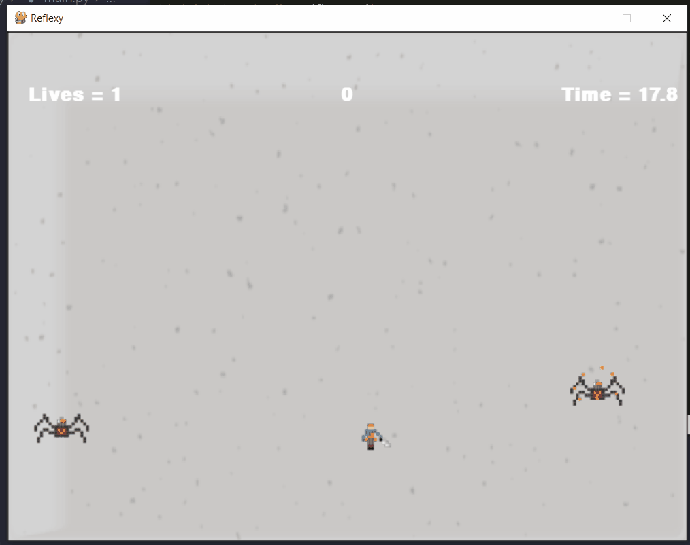

# Reflexy

### *A pixel-art pygame project*

##  🚨&nbsp;🕷 &nbsp; Concept
#### A samurai battling a bunch of robotic spiders that shoot deadly lasers, anyway, just another day in the life of a samurai...



## 📦&nbsp;🕹 &nbsp; Dependencies
 - [](https://www.pygame.org/)

## 🛠&nbsp;🧰 &nbsp; Run and Test
### Enviroment
```
$ # Create and activate a virtual environment
$ pip install requirements.txt # Install the dependencies
```
### Running
```
$ python reflexy/main.py
```
### Testing
```
$ pip install -r requirements-dev.txt # Install the dependencies
$ pytest reflexy
```
